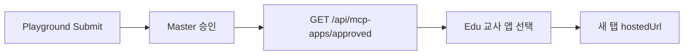

Master에서 승인한 교육앱만 교실에 나타납니다.

## 흐름



1. 개발자가 Playground에서 Submit합니다.
2. 학생 **Start**로 텍스트·이미지가 실제로 나온 뒤에 Master가 `appSlug` + `hostedUrl`로 Approve합니다. 앱 전용 교사 화면이 있으면 `supportsTeacherManage`도 켭니다. 한 번에 래핑·배포·Approve 하지 마세요. Image Studio에서 깨진 순서는 [기존 앱을 Daven에 얹기](/edu/hosted-app#image-studio에서-깨진-것)에 있습니다.
3. Edu가 승인 목록을 읽어 교사가 고릅니다.
4. 학생 **시작**은 `{hostedUrl}?session=&proxy=`를 **새 탭**으로 엽니다.

## API

공개 카탈로그 (PII 없음):

```http
GET https://daven.ai/api/mcp-apps/approved
```

Hub Nest 프록시 (교실이 이 경로를 씀):

```http
GET https://api.edu.daven.ai/api/v1/mcp-apps/approved
```

응답 `data[]`:

| 필드 | 설명 |
| --- | --- |
| `appSlug` | 교실에서 쓰는 슬러그 |
| `appName` | 표시 이름 |
| `hostedUrl` | HTTPS 앱 URL. 새 앱은 `https://{slug}.edu-app.daven.ai` |
| `embedPath` | 레거시 embed 경로 (선택) |
| `expectedCreditsPerSession` | 세션당 예상 크레딧 |
| `supportsTeacherManage` | `teacher_manage` 세션으로 교사 작업 공간을 열 수 있는지 여부 |
| `repoUrl` / `demoUrl` | 참고 링크 |

daven.ai / Nest가 비어 있거나 실패하면 Hub는 승인되지 않은 mock 앱을 만들지 않고 빈 카탈로그로 처리합니다.

## 런타임

세션·proxy 규약은 [세션과 proxy](/edu/session-proxy)를 따릅니다. 호스트·파비콘은 [기존 앱을 Daven에 얹기](/edu/hosted-app)의 **호스트와 탭 아이콘**을 복사하세요.
