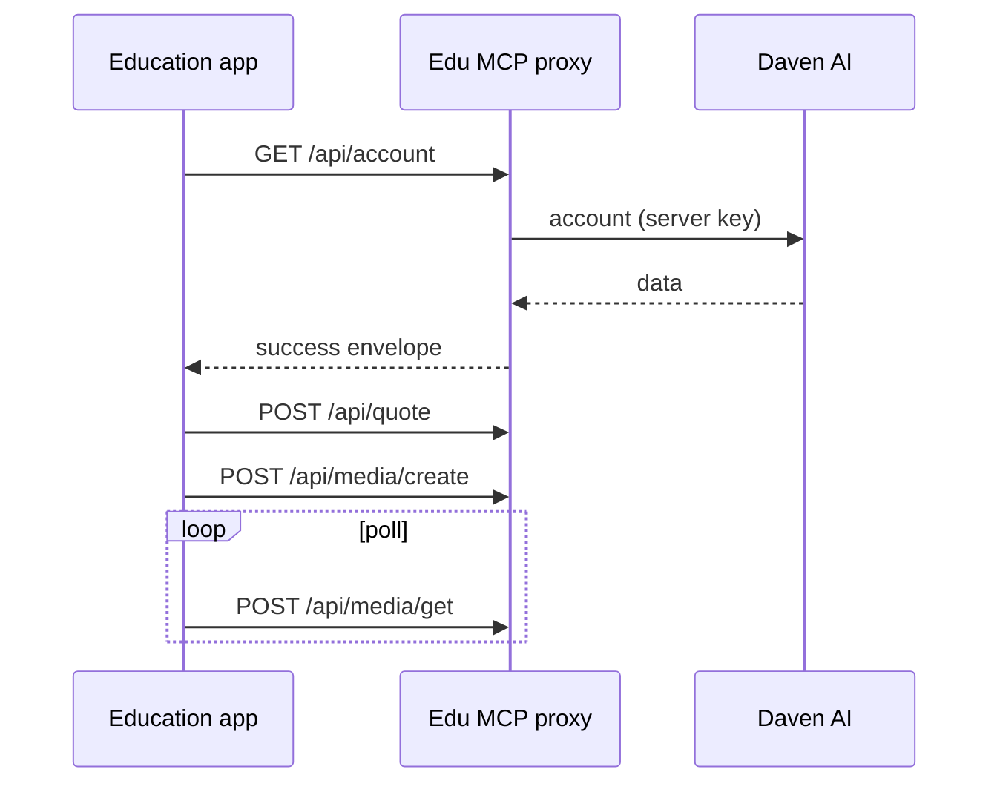

Base URL = iframe의 `proxy` 값입니다.

```text
{PROXY_BASE}/api/...
```

<Info>
  기계용 스키마: [`/edu/openapi.yaml`](/edu/openapi.yaml) · 에이전트 요약: [`/edu/llms.txt`](/edu/llms.txt)
</Info>

## 엔드포인트

| Method | Path | Auth | 용도 |
| --- | --- | --- | --- |
| `GET` | `/health` | 없음 | 헬스 |
| `GET` | `/api/account` | 세션 | 계정 / 쿼터 |
| `POST` | `/api/quote` | 세션 | 생성 전 견적 |
| `POST` | `/api/upload-url` | 세션 | 업로드 URL |
| `POST` | `/api/media/create` | 세션 | 생성 잡 시작 |
| `POST` | `/api/media/get` | 세션 | 상태 폴링 |
| `GET` | `/api/catalog` | 세션 | 카탈로그 (`kind`, `query`) |

## 응답 envelope

<Tabs>
  <Tab title="Success">
    ```json
    {
      "status": "success",
      "data": {},
      "code": "",
      "message": ""
    }
    ```
  </Tab>
  <Tab title="Error">
    ```json
    {
      "status": "error",
      "error": {
        "code": "AUTH_001",
        "message": "Invalid Edu session",
        "detail": "optional"
      }
    }
    ```
  </Tab>
</Tabs>

| HTTP | 의미 |
| --- | --- |
| `200` | 성공 (body의 `status`도 확인) |
| `401` | 세션 없음 / 무효 |

## 호출 예시

<CodeGroup>

```bash Account
curl -sS "$PROXY/api/account" \
  -H "Authorization: Bearer $SESSION" \
  -H "X-Edu-Session: $SESSION"
```

```bash Quote
curl -sS -X POST "$PROXY/api/quote" \
  -H "Authorization: Bearer $SESSION" \
  -H "X-Edu-Session: $SESSION" \
  -H "Content-Type: application/json" \
  -d '{"/* model-specific fields */": true}'
```

```bash Media create
curl -sS -X POST "$PROXY/api/media/create" \
  -H "Authorization: Bearer $SESSION" \
  -H "X-Edu-Session: $SESSION" \
  -H "Content-Type: application/json" \
  -d '{"/* model-specific fields */": true}'
```

```bash Media get
curl -sS -X POST "$PROXY/api/media/get" \
  -H "Authorization: Bearer $SESSION" \
  -H "X-Edu-Session: $SESSION" \
  -H "Content-Type: application/json" \
  -d '{"id":"MEDIA_OR_JOB_ID"}'
```

```bash Catalog
curl -sS "$PROXY/api/catalog?kind=voices" \
  -H "Authorization: Bearer $SESSION" \
  -H "X-Edu-Session: $SESSION"
```

</CodeGroup>

## 권장 플로우



<Tip>
  body 필드는 모델·도구마다 다릅니다. Daven Playground / MCP tool 스키마와 같은 계열을 쓰세요. Edu 앱은 **경로와 인증만** 이 계약을 따르면 됩니다.
</Tip>

Hub 구현 메모: `dv-edu` → `apps/api/src/mcp-proxy/`
