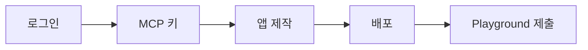

MCP 키 발급부터 교육앱 배포, Playground 제출까지의 순서입니다.



## 시작하기 전에

| 준비물 | 설명 |
| --- | --- |
| Daven 계정 | [daven.ai](https://daven.ai) 로그인 |
| 토큰 잔액 | 개발·Playground 테스트는 **본인 계정 토큰**을 사용합니다 |
| 호스팅 | 예: [Vercel](https://vercel.com) (HTTPS URL) |
| MCP 클라이언트 (선택) | 본인이 쓰는 AI 코딩 도구에 `@davenai/mcp` 연결 |

## 용어

| 용어 | 의미 |
| --- | --- |
| 교육앱 | 수업에 쓰는 웹앱. 플랫폼 내부에서는 MCP app이라고도 부릅니다. |
| MCP 키 | `dvn_mcp_live_…` 개발자 시크릿. MCP 클라이언트·서버 측 호출·Playground 검증에 씁니다. 브라우저에 넣지 마세요. |
| Playground | [daven.ai/playground](https://daven.ai/playground) — 앱을 검증하고 Daven에 제출하는 곳 |
| Classroom Hub (Edu) | [edu.daven.ai](https://edu.daven.ai) — 승인된 앱을 수업에서 쓰는 곳 |
| `@davenai/mcp` | MCP 서버. 개발할 때 AI 도구가 Daven 기능을 호출합니다. |

<Warning>
  MCP를 Vercel에 설치하지 않습니다. Vercel에는 교육앱을 배포하고, 서버 환경 변수에만 MCP 키를 둡니다. MCP 서버는 본인이 쓰는 AI 코딩 플랫폼에 연결합니다.
</Warning>

## 1. 계정과 MCP 키

<Steps>
  <Step title="Daven에 로그인">
    [daven.ai](https://daven.ai)에서 계정에 로그인합니다.
  </Step>

  <Step title="Settings > MCP Keys에서 키 발급">
    Daven AI **[설정 > MCP 키](https://daven.ai/settings?tabs=mcp)**로 이동한 뒤 키를 생성합니다.

    - 형식: `dvn_mcp_live_…` (생성 직후 한 번만 전체 값이 보입니다)
    - 활성 키는 계정당 최대 5개
    - 환경 변수 이름: `DAVEN_API_KEY`

    키를 안전한 곳에 저장하세요. Git, 프론트엔드 `.env`(`VITE_` 등), 클라이언트 번들에 넣지 마세요.
  </Step>

  <Step title="MCP 클라이언트에 연결 (선택)">
    [ChatGPT / Codex Desktop](https://chatgpt.com/codex)에서 **Settings → MCP servers → Add server**로 `@davenai/mcp`를 연결합니다. **Type은 STDIO**입니다.

    <Frame>
      
    </Frame>

    | 필드 | 값 |
    | --- | --- |
    | Type | **STDIO** |
    | Name | `daven` |
    | Command to launch | `npx` |
    | Arguments | `-y` , `@davenai/mcp` |
    | Environment variables | `DAVEN_API_KEY` = 발급한 키<br />`DAVEN_API_URL` = `https://app.daven.ai:3000`<br />`DAVEN_WEBAPP_URL` = `https://daven.ai` |
    | Working directory | `/` |

    저장한 뒤 MCP를 Restart 합니다. 연결되면 에이전트가 계정·견적·미디어 도구로 구현을 도울 수 있습니다. 앱 작성 규칙은 `daven_guidelines`를 따르면 됩니다.
  </Step>
</Steps>

## 2. 교육앱 만들기

**브라우저 → 서버 측 API → Daven**. 키는 서버(또는 Vercel serverless)에만 둡니다.

로컬 랩·레퍼런스: `dv_mcp` (`starter/`, `apps/sihwa_project`). → [레퍼런스 앱](/edu/reference-app)

```bash
cd dv_mcp
cp .env.example .env   # DAVEN_API_KEY, DAVEN_WEBAPP_URL, DAVEN_API_URL
npm install
npm run starter
```

UI와 수업 플로우는 자유롭게 설계하면 됩니다.

## 3. 배포

Playground 제출에는 **공개 HTTPS URL**이 필요합니다.

1. Vercel 등에 프로젝트를 연결합니다 (Root Directory 예: `apps/sihwa_project`).
2. **서버 전용** 환경 변수를 설정합니다 (`VITE_` 접두사 금지):

| Variable | Example |
| --- | --- |
| `DAVEN_API_KEY` | `dvn_mcp_live_…` |
| `DAVEN_WEBAPP_URL` | `https://daven.ai` |
| `DAVEN_API_URL` | `https://app.daven.ai:3000` |

3. 배포 URL에서 앱이 정상 동작하는지 확인합니다.

레퍼런스: `dv_mcp/apps/sihwa_project/DEPLOY.md`

## 4. Playground에서 검증·제출

1. [daven.ai/playground](https://daven.ai/playground)를 엽니다.
2. 앱 URL을 넣습니다 — 로컬 또는 Vercel Preview/Production.
3. MCP 키로 체크리스트를 통과합니다.
4. **Submit to Daven**으로 제출합니다.

여기까지가 개발자 작업의 끝입니다. 이후 검수·교실 배포는 Daven 쪽에서 진행합니다.

Playground AI 사용량은 **개발자 계정 토큰**에서 차감됩니다. 수업에서 쓸 때는 **교실 크레딧**이 사용됩니다.

## 완료 기준

| 단계 | 통과 조건 |
| --- | --- |
| 키 | **설정 > MCP 키**에서 발급, 클라이언트에 노출되지 않음 |
| 앱 | 서버 경유로 Daven 호출 성공 |
| 배포 | HTTPS URL에서 동작 |
| 제출 | Playground 체크리스트 통과 후 Submit |

## 다음 읽기

- [연동 체크리스트](/edu/checklist)
- [레퍼런스 앱](/edu/reference-app)
