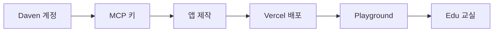

교육앱을 처음부터 교실까지 올리는 **개발자 경로**입니다. Cursor·Claude 같은 도구로 바이브코딩해도, 아래 순서는 같습니다.



<Info>
  **목표:** HTTPS로 호스팅된 앱을 [Playground](https://daven.ai/playground)에서 검증한 뒤, Classroom Hub([edu.daven.ai](https://edu.daven.ai)) iframe에서 동작하게 합니다.
</Info>

## 시작하기 전에

| 준비물 | 설명 |
| --- | --- |
| Daven 계정 | [daven.ai](https://daven.ai) 로그인 |
| 토큰 잔액 | 개발·Playground 테스트는 **본인 계정 토큰**을 사용합니다 |
| 호스팅 | 예: [Vercel](https://vercel.com) (HTTPS URL) |
| 에디터 (선택) | Cursor + `@daven/mcp` — AI 보조 코딩용 |

## 용어

교육앱 문서에서 쓰는 말을 먼저 맞춰 둡니다.

<Columns cols={2}>
  <Card title="교육앱" icon="puzzle-piece" type="tip">
    수업용 웹앱. Edu가 iframe으로 엽니다. 플랫폼 내부에서는 MCP app이라고도 부릅니다.
  </Card>
  <Card title="MCP 키" icon="key" type="note">
    `dvn_mcp_live_…` 형태의 개발자 시크릿. Cursor·로컬/서버 proxy·Playground 검증에 씁니다. **브라우저 번들에 넣지 마세요.**
  </Card>
  <Card title="Playground" icon="flask" type="info">
    [daven.ai/playground](https://daven.ai/playground) — 앱 URL을 넣고 체크리스트를 통과한 뒤 Daven에 제출합니다.
  </Card>
  <Card title="Classroom Hub (Edu)" icon="school" type="check">
    [edu.daven.ai](https://edu.daven.ai) — 학급·활동·교실 크레딧. 승인된 교육앱을 학생에게 보여 줍니다.
  </Card>
</Columns>

| 용어 | 의미 |
| --- | --- |
| **`@daven/mcp`** | Cursor/Claude용 MCP 서버. **개발 시간**에 AI가 Daven 도구를 호출합니다. 교실 런타임이 아닙니다. |
| **HTTP proxy** | 앱이 Daven을 부를 때 키가 있는 서버 측 경로. 로컬 `:8787` 또는 Vercel `/api/*`. |
| **Edu MCP proxy** | 교실에서 쓰는 `…/api/v1/mcp-proxy`. 학생 브라우저의 MCP 키 대신 **세션**으로 인증합니다. |
| **session / proxy** | Edu가 iframe URL에 붙이는 쿼리. 상세는 [세션과 proxy](/edu/session-proxy). |

<Warning>
  **MCP를 Vercel에 설치하지 않습니다.** Vercel에는 **교육앱**을 배포하고, 서버 환경 변수에만 MCP 키를 둡니다. MCP 서버 설치 대상은 Cursor(또는 동등한 IDE)입니다.
</Warning>

## 1. 계정과 MCP 키

<Steps>
  <Step title="Daven에 로그인">
    [daven.ai](https://daven.ai)에서 계정에 로그인합니다.
  </Step>

  <Step title="Developer / MCP에서 키 발급">
    **Settings → Developer / MCP**로 이동한 뒤 키를 생성합니다.

    - 형식: `dvn_mcp_live_…` (생성 직후 한 번만 전체 값이 보입니다)
    - 활성 키는 계정당 최대 5개
    - 환경 변수 이름: `DAVEN_API_KEY`

    키를 안전한 곳에 저장하세요. Git, 프론트엔드 `.env`(`VITE_` 등), 클라이언트 번들에 넣지 마세요.
  </Step>

  <Step title="Cursor에 MCP 연결 (선택)">
    바이브코딩으로 앱을 만들 때 Settings 화면에 있는 Cursor 스니펫을 붙여 넣습니다. 대략 다음 형태입니다.

    ```json
    {
      "mcpServers": {
        "daven": {
          "command": "npx",
          "args": ["-y", "@daven/mcp"],
          "env": {
            "DAVEN_API_KEY": "<your-mcp-key>",
            "DAVEN_WEBAPP_URL": "https://daven.ai",
            "DAVEN_API_URL": "https://api.daven.ai"
          }
        }
      }
    }
    ```

    에이전트가 계정·견적·미디어 생성 도구를 쓰며 구현을 돕습니다. **완성된 앱의 런타임 경로와는 별개**입니다.
  </Step>
</Steps>

## 2. 교육앱 만들기

권장 패턴은 **브라우저 → 서버 proxy → Daven** 입니다. 키는 proxy(또는 Vercel serverless)에만 둡니다.

<Columns cols={2}>
  <Card title="Starter / 로컬 랩" icon="code" href="/edu/reference-app">
    `dv_mcp` 모노레포 — `starter/`, 레퍼런스 `apps/sihwa_project`, 로컬 proxy `:8787`
  </Card>
  <Card title="보안 원칙" icon="shield" type="warning">
    클라이언트에서 `daven.ai` / `app.daven.ai`를 직접 호출하지 마세요. 키 없는 fetch는 실패하거나 키가 유출됩니다.
  </Card>
</Columns>

로컬에서 빠르게 시작할 때:

```bash
cd dv_mcp
cp .env.example .env   # DAVEN_API_KEY, DAVEN_WEBAPP_URL, DAVEN_API_URL
npm install
npm run starter        # proxy + React
```

앱 UI는 자유입니다. 교실에 넣으려면 나중에 Edu가 넘기는 `session` / `proxy`를 읽을 수 있어야 합니다. → [세션과 proxy](/edu/session-proxy)

## 3. Vercel에 배포

Playground·검수·Edu 임베드에는 **공개 HTTPS URL**이 필요합니다.

1. 프로젝트를 Vercel에 연결합니다 (Root Directory는 앱 폴더, 예: `apps/sihwa_project`).
2. **서버 전용** 환경 변수를 설정합니다 (`VITE_` 접두사 금지):

| Variable | Example |
| --- | --- |
| `DAVEN_API_KEY` | `dvn_mcp_live_…` |
| `DAVEN_WEBAPP_URL` | `https://daven.ai` |
| `DAVEN_API_URL` | `https://api.daven.ai` |

3. 배포 후 앱이 같은 오리진의 `/api/*`(또는 동등한 serverless proxy)로 Daven을 호출하는지 확인합니다.
4. 헬스 체크가 있다면 `hasKey: true`인지 봅니다.

레퍼런스 배포 노트: `dv_mcp/apps/sihwa_project/DEPLOY.md`

## 4. Playground에서 검증

1. [daven.ai/playground](https://daven.ai/playground)를 엽니다.
2. 앱 URL을 넣습니다 — 로컬(`http://localhost:…`) 또는 Vercel Preview/Production.
3. MCP 키로 체크리스트를 통과합니다 (계정·견적 등).
4. 통과하면 **Submit to Daven**으로 검수 큐에 올립니다.

<Tip>
  Playground 단계의 AI 사용량은 **개발자 계정 토큰**에서 차감됩니다. 교실에서는 **교실 크레딧**으로 바뀝니다.
</Tip>

## 5. 검수 후 Edu에서 사용

1. Daven Master가 앱을 승인하고 `hostedUrl` 등을 확정합니다.
2. Classroom Hub에서 해당 교육앱 활동을 게시합니다.
3. 학생이 활동을 열면 Edu가 앱을 iframe으로 로드합니다.

```text
https://your-app.vercel.app/?session={TOKEN}&proxy=https://edu.daven.ai/api/v1/mcp-proxy
```

이때 앱은 MCP 키 대신 **세션 + Edu MCP proxy**로 생성 API를 호출합니다. 계약 상세: [Proxy API](/edu/proxy-api) · [연동 체크리스트](/edu/checklist)

## 완료 기준

| 단계 | 통과 조건 |
| --- | --- |
| 키 | Settings에서 `dvn_mcp_live_…` 발급, 클라이언트에 노출되지 않음 |
| 앱 | proxy 경유로 account / 생성 호출 성공 |
| 배포 | HTTPS URL에서 동일하게 동작 |
| Playground | 체크리스트 통과 후 Submit |
| Edu | iframe에서 `session`으로 동작 (키 불필요) |

## 다음 읽기

<Columns cols={3}>
  <Card title="세션과 proxy" icon="link" href="/edu/session-proxy" arrow="true">
    iframe 런타임 계약
  </Card>
  <Card title="연동 체크리스트" icon="list-check" href="/edu/checklist" arrow="true">
    출시 전 점검
  </Card>
  <Card title="레퍼런스 앱" icon="code" href="/edu/reference-app" arrow="true">
    시화 스튜디오
  </Card>
</Columns>

코딩 에이전트용 결정적 스펙이 필요하면 [에이전트 스펙](/edu/agent-spec)과 [`llms.txt`](/edu/llms.txt)를 참고하세요.
