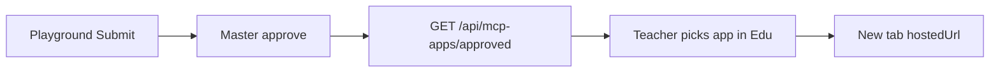

Only apps approved in Master show up in the classroom.

## Flow



1. The developer Submits from Playground.
2. Master Approves with `appSlug` + `hostedUrl`.
3. Edu reads the approved list for the teacher picker.
4. Student **Start** opens `{hostedUrl}?session=&proxy=` in a **new tab**.

## API

Public catalog (no submitter PII):

```http
GET https://daven.ai/api/mcp-apps/approved
```

Hub Nest proxy (what the classroom uses):

```http
GET https://api.edu.daven.ai/api/v1/mcp-apps/approved
```

`data[]` fields: `appSlug`, `appName`, `hostedUrl`, `embedPath`, `expectedCreditsPerSession`, `repoUrl`, `demoUrl`.

If daven.ai / Nest is empty or down locally, Hub falls back to the mock Sihwa app.

## Runtime

Follow [Session & proxy](/en/edu/session-proxy) for session and proxy query params.
