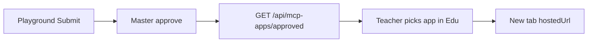

Only apps approved in Master show up in the classroom.

## Flow



1. The developer Submits from Playground.
2. Master Approves with `appSlug` + `hostedUrl` only after a student **Start** returns real text and a real image. If the app has a teacher-specific workspace, Master also enables `supportsTeacherManage`. Do not wrap, deploy, and Approve in one shot. Image Studio failures are in [Host an existing app](/en/edu/hosted-app#what-broke-on-image-studio).
3. Edu reads the approved list for the teacher picker.
4. Student **Start** opens `{hostedUrl}?session=&proxy=` in a **new tab**.

## API

Public catalog (no submitter PII):

```http
GET https://daven.ai/api/mcp-apps/approved
```

Hub Nest proxy (what the classroom uses):

```http
GET https://api.edu.daven.ai/api/v1/mcp-apps/approved
```

`data[]` fields: `appSlug`, `appName`, `hostedUrl`, `embedPath`, `expectedCreditsPerSession`, `supportsTeacherManage`, `repoUrl`, `demoUrl`.

`supportsTeacherManage` allows the Hub to mint a `teacher_manage` session and show the app-specific teacher workspace launch. It defaults to `false` for existing apps.

If daven.ai or Nest is empty or unavailable, Hub returns an empty catalog instead of inventing an unapproved mock app.

## Runtime

Follow [Session & proxy](/en/edu/session-proxy) for session and proxy query params. Copy **Host and tab icon** from [Host an existing app](/en/edu/hosted-app) for `{slug}.edu-app.daven.ai` and the Classroom Hub favicon.
