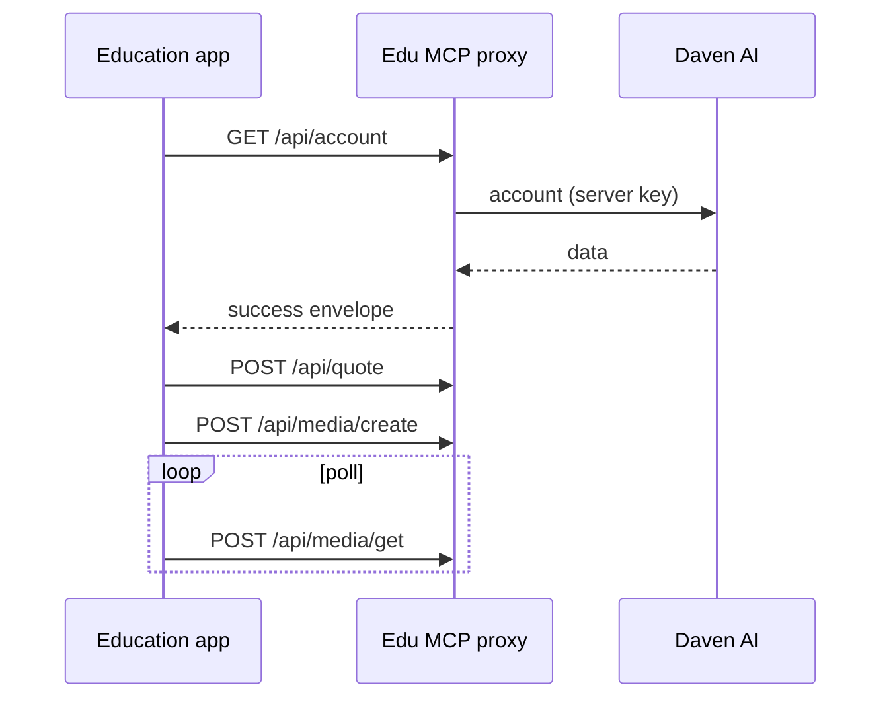

Base URL = the iframe `proxy` value.

```text
{PROXY_BASE}/api/...
```

<Info>
  Machine schema: [`/edu/openapi.yaml`](/edu/openapi.yaml) · Agent dump: [`/en/edu/llms.txt`](/en/edu/llms.txt)
</Info>

## Endpoints

| Method | Path | Auth | Purpose |
| --- | --- | --- | --- |
| `GET` | `/health` | none | Health |
| `GET` | `/api/account` | session | Account / quota |
| `POST` | `/api/quote` | session | Pre-generation quote |
| `POST` | `/api/upload-url` | session | Upload URL |
| `POST` | `/api/media/create` | session | Start job |
| `POST` | `/api/media/get` | session | Poll status |
| `GET` | `/api/catalog` | session | Catalog (`kind`, `query`) |

## Response envelope

<Tabs>
  <Tab title="Success">
    ```json
    {
      "status": "success",
      "data": {},
      "code": "",
      "message": ""
    }
    ```
  </Tab>
  <Tab title="Error">
    ```json
    {
      "status": "error",
      "error": {
        "code": "AUTH_001",
        "message": "Invalid Edu session",
        "detail": "optional"
      }
    }
    ```
  </Tab>
</Tabs>

| HTTP | Meaning |
| --- | --- |
| `200` | Success (still check body `status`) |
| `401` | Missing / invalid session |

## Examples

<CodeGroup>

```bash Account
curl -sS "$PROXY/api/account" \
  -H "Authorization: Bearer $SESSION" \
  -H "X-Edu-Session: $SESSION"
```

```bash Quote
curl -sS -X POST "$PROXY/api/quote" \
  -H "Authorization: Bearer $SESSION" \
  -H "X-Edu-Session: $SESSION" \
  -H "Content-Type: application/json" \
  -d '{"/* model-specific fields */": true}'
```

```bash Media create
curl -sS -X POST "$PROXY/api/media/create" \
  -H "Authorization: Bearer $SESSION" \
  -H "X-Edu-Session: $SESSION" \
  -H "Content-Type: application/json" \
  -d '{"/* model-specific fields */": true}'
```

```bash Media get
curl -sS -X POST "$PROXY/api/media/get" \
  -H "Authorization: Bearer $SESSION" \
  -H "X-Edu-Session: $SESSION" \
  -H "Content-Type: application/json" \
  -d '{"id":"MEDIA_OR_JOB_ID"}'
```

```bash Catalog
curl -sS "$PROXY/api/catalog?kind=voices" \
  -H "Authorization: Bearer $SESSION" \
  -H "X-Edu-Session: $SESSION"
```

</CodeGroup>

## Recommended flow



<Tip>
  Request bodies vary by model/tool — same family as Daven Playground / MCP tools. Edu apps only need this **path + auth** contract.
</Tip>

Hub implementation: `dv-edu` → `apps/api/src/mcp-proxy/`
