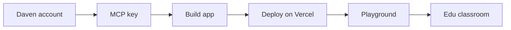

This is the **developer path** for shipping an education app into the classroom. Whether you vibe-code with Cursor or Claude, the sequence is the same.



<Info>
  **Goal:** Host an HTTPS app, verify it in the [Playground](https://daven.ai/playground), then run it inside Classroom Hub ([edu.daven.ai](https://edu.daven.ai)).
</Info>

## Before you begin

| Prerequisite | Notes |
| --- | --- |
| Daven account | Sign in at [daven.ai](https://daven.ai) |
| Token balance | Dev and Playground usage bill **your account tokens** |
| Hosting | e.g. [Vercel](https://vercel.com) (HTTPS URL) |
| Editor (optional) | Cursor + `@daven/mcp` for AI-assisted coding |

## Concepts

Align on the vocabulary used across these docs.

<Columns cols={2}>
  <Card title="Education app" icon="puzzle-piece" type="tip">
    Your lesson web app. Edu opens it in an iframe. Internally also called an MCP app.
  </Card>
  <Card title="MCP key" icon="key" type="note">
    Developer secret shaped like `dvn_mcp_live_…`. Used for Cursor, local/server proxies, and Playground checks. **Never ship it in the browser bundle.**
  </Card>
  <Card title="Playground" icon="flask" type="info">
    [daven.ai/playground](https://daven.ai/playground) — paste your app URL, pass the checklist, submit to Daven.
  </Card>
  <Card title="Classroom Hub (Edu)" icon="school" type="check">
    [edu.daven.ai](https://edu.daven.ai) — classes, activities, classroom credits. Serves approved apps to students.
  </Card>
</Columns>

| Term | Meaning |
| --- | --- |
| **`@daven/mcp`** | MCP server for Cursor/Claude. **Dev-time** tools for the agent — not classroom runtime. |
| **HTTP proxy** | Server path that holds the key when your app calls Daven. Local `:8787` or Vercel `/api/*`. |
| **Edu MCP proxy** | Classroom endpoint `…/api/v1/mcp-proxy`. Auth is a **session**, not the developer MCP key. |
| **session / proxy** | Query params Edu appends to the iframe URL. Details: [Session & proxy](/en/edu/session-proxy). |

<Warning>
  **You do not install MCP on Vercel.** Vercel hosts the **education app**; put the MCP key only in **server** environment variables. Install the MCP server in Cursor (or an equivalent IDE).
</Warning>

## 1. Account and MCP key

<Steps>
  <Step title="Sign in to Daven">
    Log in at [daven.ai](https://daven.ai).
  </Step>

  <Step title="Create a key under Developer / MCP">
    Open **Settings → Developer / MCP** and generate a key.

    - Format: `dvn_mcp_live_…` (full value shown once)
    - Up to 5 active keys per account
    - Env var name: `DAVEN_API_KEY`

    Store it securely. Do not commit it, put it in frontend env (`VITE_*`), or ship it in the client bundle.
  </Step>

  <Step title="Connect Cursor MCP (optional)">
    For vibe-coding, paste the Cursor snippet from Settings. It looks like:

    ```json
    {
      "mcpServers": {
        "daven": {
          "command": "npx",
          "args": ["-y", "@daven/mcp"],
          "env": {
            "DAVEN_API_KEY": "<your-mcp-key>",
            "DAVEN_WEBAPP_URL": "https://daven.ai",
            "DAVEN_API_URL": "https://api.daven.ai"
          }
        }
      }
    }
    ```

    The agent can call account, quote, and media tools while you build. That path is **separate from** the finished app’s runtime.
  </Step>
</Steps>

## 2. Build the education app

Recommended pattern: **browser → server proxy → Daven**. Keep the key only on the proxy (or Vercel serverless).

<Columns cols={2}>
  <Card title="Starter / local lab" icon="code" href="/en/edu/reference-app">
    `dv_mcp` monorepo — `starter/`, reference `apps/sihwa_project`, local proxy `:8787`
  </Card>
  <Card title="Security rule" icon="shield" type="warning">
    Do not call `daven.ai` / `app.daven.ai` directly from the client. Keyless calls fail — or leak the key.
  </Card>
</Columns>

Local quick start:

```bash
cd dv_mcp
cp .env.example .env   # DAVEN_API_KEY, DAVEN_WEBAPP_URL, DAVEN_API_URL
npm install
npm run starter        # proxy + React
```

UI is up to you. For classroom embed, the app must later read Edu’s `session` / `proxy`. → [Session & proxy](/en/edu/session-proxy)

## 3. Deploy on Vercel

Playground, review, and Edu embed need a **public HTTPS URL**.

1. Connect the project on Vercel (Root Directory = app folder, e.g. `apps/sihwa_project`).
2. Set **server-only** env vars (no `VITE_` prefix):

| Variable | Example |
| --- | --- |
| `DAVEN_API_KEY` | `dvn_mcp_live_…` |
| `DAVEN_WEBAPP_URL` | `https://daven.ai` |
| `DAVEN_API_URL` | `https://api.daven.ai` |

3. Confirm the app reaches Daven through same-origin `/api/*` (or an equivalent serverless proxy).
4. If you have a health route, expect `hasKey: true`.

Reference: `dv_mcp/apps/sihwa_project/DEPLOY.md`

## 4. Verify in Playground

1. Open [daven.ai/playground](https://daven.ai/playground).
2. Paste the app URL — local (`http://localhost:…`) or Vercel Preview/Production.
3. Pass the checklist with your MCP key (account, quote, …).
4. **Submit to Daven** to enter the review queue.

<Tip>
  Playground AI usage bills **your developer tokens**. In class, billing switches to **classroom credits**.
</Tip>

## 5. After approval — use in Edu

1. Daven Master approves the app and sets `hostedUrl` (and related fields).
2. Teachers publish the education-app activity in Classroom Hub.
3. When a student opens it, Edu loads your app in an iframe:

```text
https://your-app.vercel.app/?session={TOKEN}&proxy=https://edu.daven.ai/api/v1/mcp-proxy
```

At runtime the app calls generation APIs with **session + Edu MCP proxy**, not the MCP key. Details: [Proxy API](/en/edu/proxy-api) · [Checklist](/en/edu/checklist)

## Done when

| Stage | Pass criteria |
| --- | --- |
| Key | `dvn_mcp_live_…` issued in Settings; never exposed to the client |
| App | Account / generation works via proxy |
| Deploy | Same behavior on HTTPS |
| Playground | Checklist passed + Submit |
| Edu | Works in iframe with `session` (no key) |

## Next

<Columns cols={3}>
  <Card title="Session & proxy" icon="link" href="/en/edu/session-proxy" arrow="true">
    iframe runtime contract
  </Card>
  <Card title="Checklist" icon="list-check" href="/en/edu/checklist" arrow="true">
    Pre-launch review
  </Card>
  <Card title="Reference app" icon="code" href="/en/edu/reference-app" arrow="true">
    Sihwa Studio
  </Card>
</Columns>

For coding-agent machine contracts, see [Agent spec](/en/edu/agent-spec) and [`llms.txt`](/en/edu/llms.txt).
