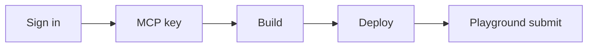

This guide covers **only what you do** to ship an education app. How the app reaches the classroom is handled by Daven.



## Before you begin

| Prerequisite | Notes |
| --- | --- |
| Daven account | Sign in at [daven.ai](https://daven.ai) |
| Token balance | Dev and Playground usage bill **your account tokens** |
| Hosting | e.g. [Vercel](https://vercel.com) (HTTPS URL) |
| MCP client (optional) | Connect `@davenai/mcp` in the AI coding tool you already use |

## Concepts

| Term | Meaning |
| --- | --- |
| Education app | Web app for lessons. Internally also called an MCP app. |
| MCP key | Developer secret `dvn_mcp_live_…`. Used for your MCP client, server-side calls, and Playground. Never put it in the browser. |
| Playground | [daven.ai/playground](https://daven.ai/playground) — verify your app and submit it to Daven |
| Classroom Hub (Edu) | [edu.daven.ai](https://edu.daven.ai) — where approved apps are used in class |
| `@davenai/mcp` | MCP server so your AI coding tool can call Daven while you build |

<Warning>
  You do not install MCP on Vercel. Deploy the education app on Vercel and keep the MCP key in **server** env vars. Connect the MCP server in the AI coding platform you use.
</Warning>

## 1. Account and MCP key

<Steps>
  <Step title="Sign in to Daven">
    Log in at [daven.ai](https://daven.ai).
  </Step>

  <Step title="Create a key under Developer / MCP">
    Open **Settings → Developer / MCP** and generate a key.

    - Format: `dvn_mcp_live_…` (full value shown once)
    - Up to 5 active keys per account
    - Env var name: `DAVEN_API_KEY`

    Store it securely. Do not commit it, put it in frontend env (`VITE_*`), or ship it in the client bundle.
  </Step>

  <Step title="Connect your MCP client (optional)">
    Add `@davenai/mcp` in the MCP settings of the AI coding platform you use. See the example config under Settings → Developer / MCP.

    ```json
    {
      "mcpServers": {
        "daven": {
          "command": "npx",
          "args": ["-y", "@davenai/mcp"],
          "env": {
            "DAVEN_API_KEY": "<your-mcp-key>",
            "DAVEN_WEBAPP_URL": "https://daven.ai",
            "DAVEN_API_URL": "https://api.daven.ai"
          }
        }
      }
    }
    ```

    UI and config paths differ by platform. After connecting, the agent can use account, quote, and media tools while you build. App-writing rules live in the MCP tool `daven_guidelines`.
  </Step>
</Steps>

## 2. Build the education app

**Browser → server API → Daven**. Keep the key on the server (or Vercel serverless) only.

Local lab / reference: `dv_mcp` (`starter/`, `apps/sihwa_project`). → [Reference app](/en/edu/reference-app)

```bash
cd dv_mcp
cp .env.example .env   # DAVEN_API_KEY, DAVEN_WEBAPP_URL, DAVEN_API_URL
npm install
npm run starter
```

Design the UI and lesson flow as you like.

## 3. Deploy

Playground submit needs a **public HTTPS URL**.

1. Connect the project on Vercel (Root Directory e.g. `apps/sihwa_project`).
2. Set **server-only** env vars (no `VITE_` prefix):

| Variable | Example |
| --- | --- |
| `DAVEN_API_KEY` | `dvn_mcp_live_…` |
| `DAVEN_WEBAPP_URL` | `https://daven.ai` |
| `DAVEN_API_URL` | `https://api.daven.ai` |

3. Confirm the app works on the deploy URL.

Reference: `dv_mcp/apps/sihwa_project/DEPLOY.md`

## 4. Verify and submit in Playground

1. Open [daven.ai/playground](https://daven.ai/playground).
2. Paste the app URL — local or Vercel Preview/Production.
3. Pass the checklist with your MCP key.
4. **Submit to Daven**.

That is the end of the developer workflow. Review and classroom rollout are handled by Daven.

Playground AI usage bills **your developer tokens**. In class, **classroom credits** are used.

## Done when

| Stage | Pass criteria |
| --- | --- |
| Key | Issued in Settings; never exposed to the client |
| App | Daven calls succeed via the server path |
| Deploy | Works on HTTPS |
| Submit | Playground checklist passed + Submit |

## Next

- [Checklist](/en/edu/checklist)
- [Reference app](/en/edu/reference-app)
